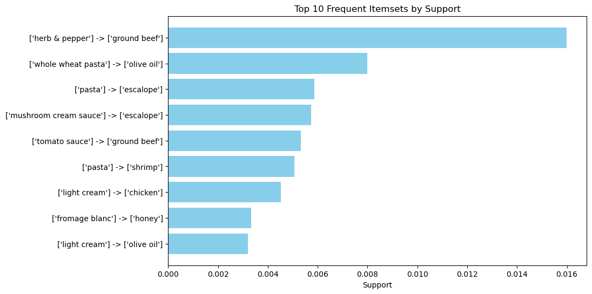
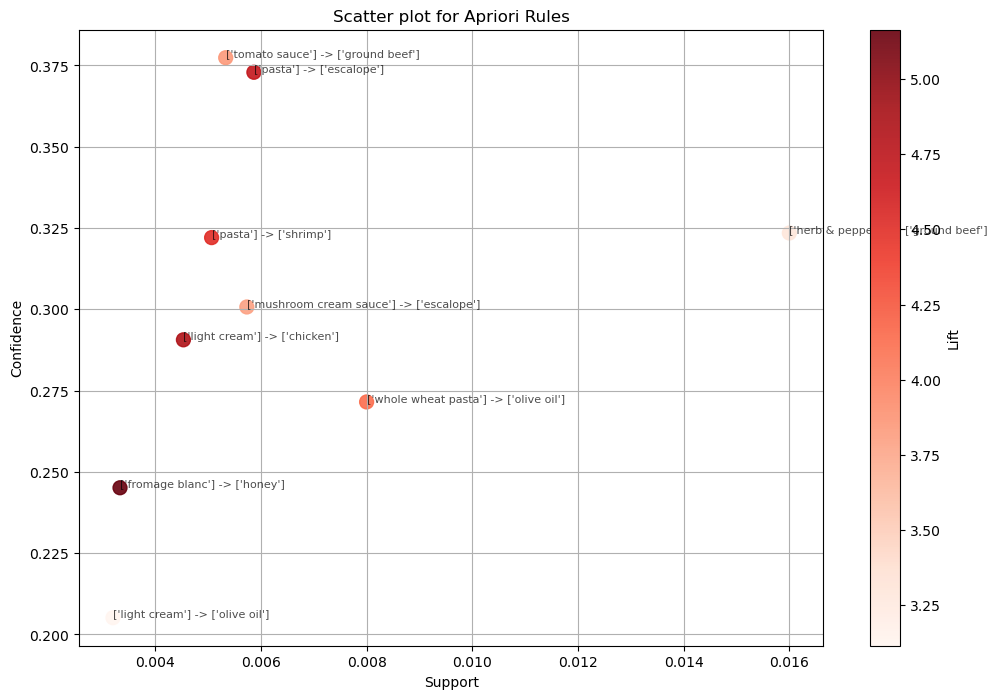

## 📎 Clustering

- Apriori
- Eclat
---

## 📉 Visualization

Visualization plot of different association rule learning model.

|  |  |
|:--------------------------------:|:--------------------------------:|
| **Apriori**          | **Eclat**          |

|    |
|:---------------------------------:|
| **Apriori (Support vs Confidence)** |
---

## 🛠️ Requirements

- Numpy
- Pandas 
- Matplotlib
- Apyori
- Jupyter Notebook
