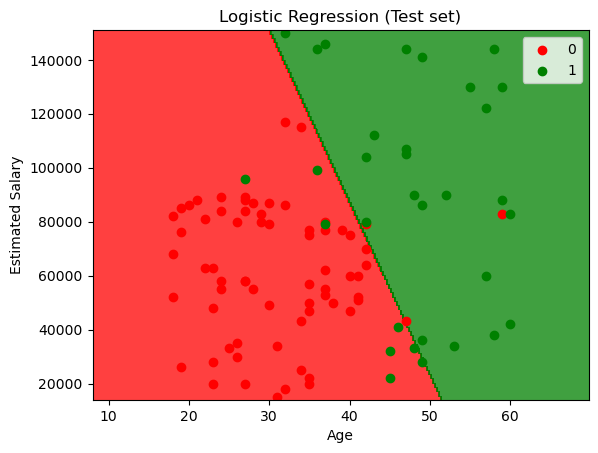
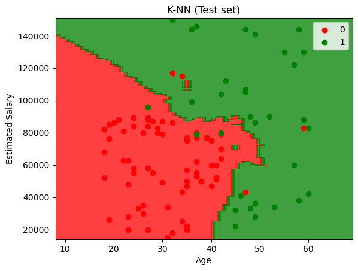
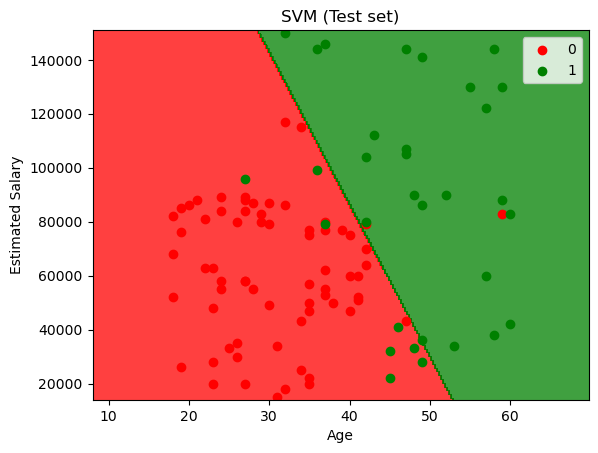
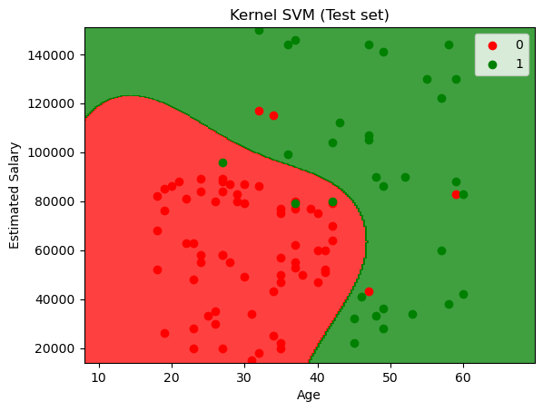
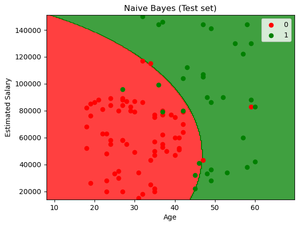
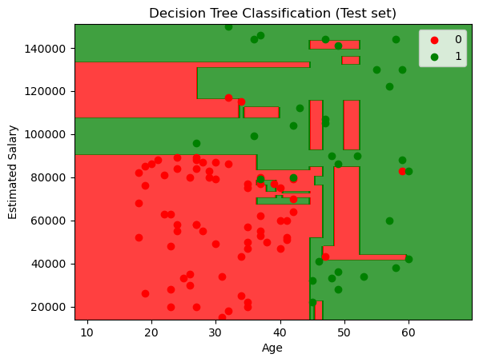
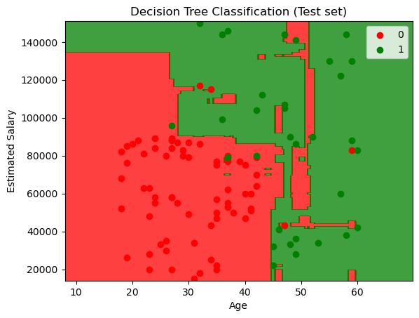
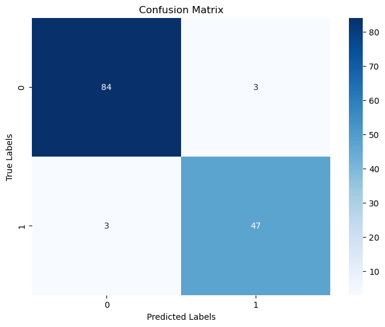

## 📎 Classification

- Logistic Regression
- K-Nearest Neighbors 
- Support Vector Machines
- Kernel SVM
- Naive Bayes
- Decision Tree Classification
- Random Forest Classification

---

## 📉 Visualization

Visualization plot of different classification method on different dataset.

|  |  |
|:--------------------------------:|:--------------------------------:|
| **Logistic Regression**          | **K-Nearest Neighbors**          | 

|  |  |  |
|:--------------------------------:|:--------------------------------:|:--------------------------------:|
| **Support Vector Machines**          | **Kernel SVM**          | **Naive Bayes**          |

|  |  |
|:--------------------------------:|:--------------------------------:|
| **Decision Tree**          | **Random Forest**          | 

|    |
|:---------------------------------:|
| **Breast Cancer Detection (Logistic Regression)** |

---

## 🛠️ Requirements

- Numpy
- Pandas 
- Scikit-learn
- Matplotlib
- Jupyter Notebook
