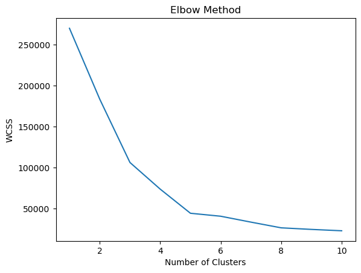
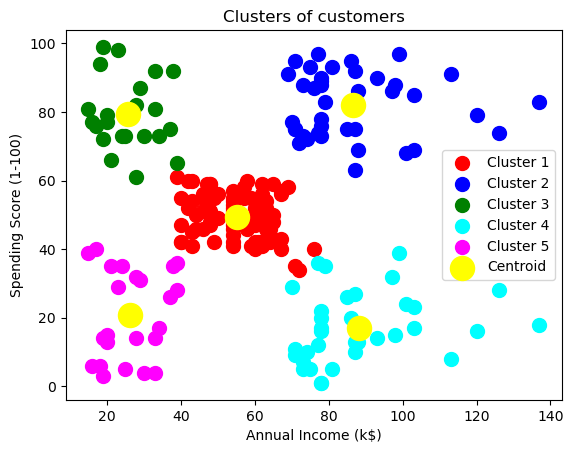
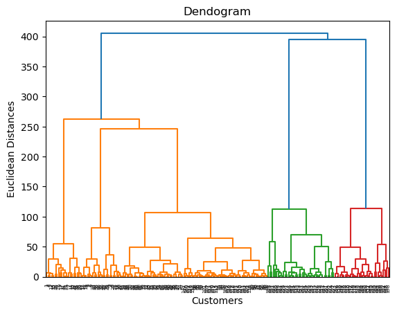
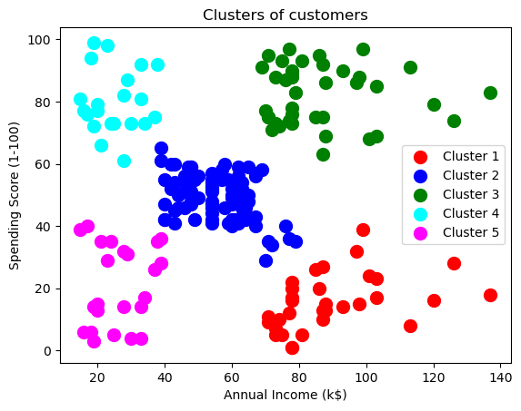

## 📎 Clustering

- K-Means Clustering
- Hierarchical Clustering

---

## 📉 Visualization

Visualization plot of different clustering method.

|  |  |
|:--------------------------------:|:--------------------------------:|
| **Elbow Method**          | **K-Means Clustering**          |

|  |  |
|:--------------------------------:|:--------------------------------:|
| **Dendogram**          | **Hierarchical Clustering**          |

---

## 🛠️ Requirements

- Numpy
- Pandas 
- Scikit-learn
- Matplotlib
- Jupyter Notebook

