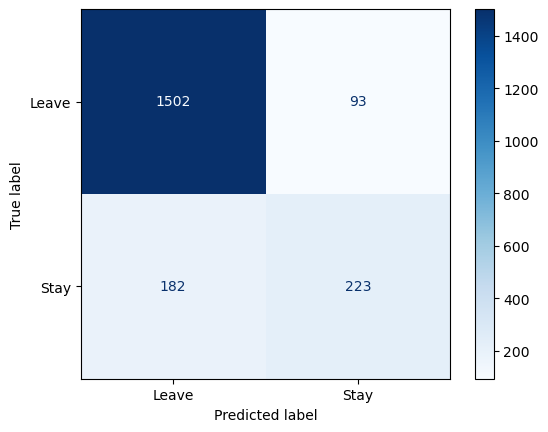

## 📎 Deep Learning

- Artificial Neural Networks
- Convolutional Neural Networks

---

## 📉 Visualization

Visualization of different Deep Learning model.

|  |  |
|:--------------------------------:|:--------------------------------:|
| **Artificial Neural Network**          | **Convolutional Neural Networks**          |

---

## 🛠️ Requirements

- Numpy
- Pandas 
- Matplotlib
- Tensorflow
- Jupyter Notebook

### Note: 
- This implementation uses tensorflow-metal.
- Dataset used in this implementation 👉 [Cat and Dog](https://www.kaggle.com/datasets/tongpython/cat-and-dog).
