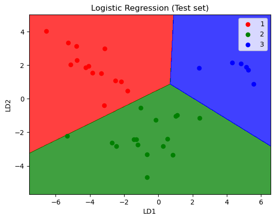
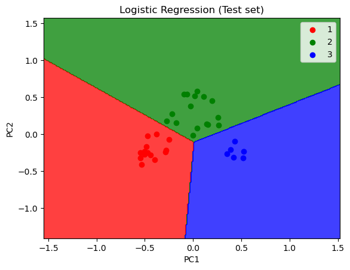

## 📎 PCA

- Principal Component Analysis
- Linear Discriminant Analysis
- Kernel PCA

---

## 📉 Visualization

Visualization plot of different dimentionality reduction method on same dataset.

|  |  |  |
|:--------------------------------:|:--------------------------------:|:--------------------------------:|
| **Principal Component Analysis**          | **Linear Discriminant Analysis**          | **Kernel Principal Component Analysis**          |

---

## 🛠️ Requirements

- Numpy
- Pandas 
- Scikit-learn
- Matplotlib
- Jupyter Notebook

