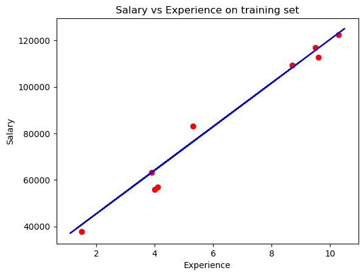
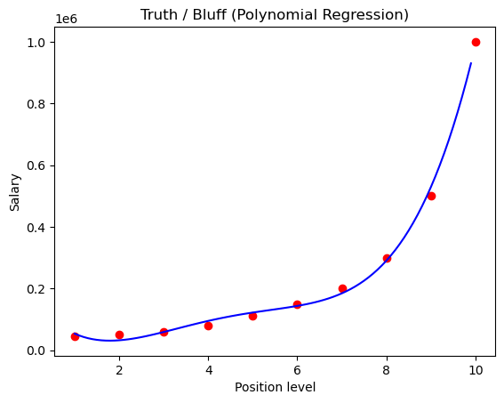
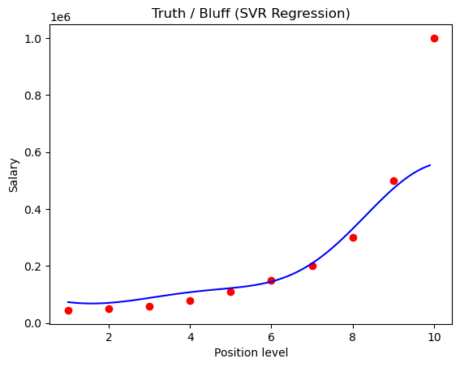
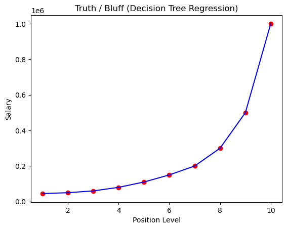
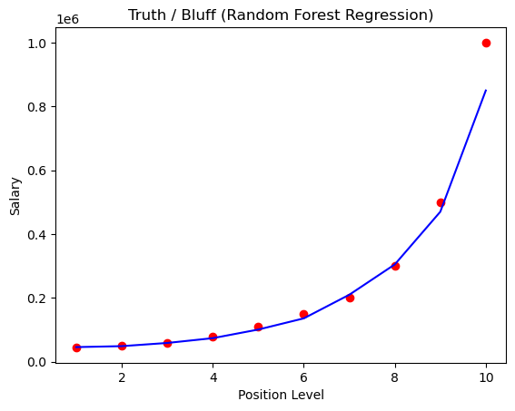

## 📎 Regession

- Simple Linear Regression
- Multiple Linear Regression
- Polynomial Regression
- Support Vector Regression
- Decision Tree Regression
- Random Forest Regression

---

## 📉 Visualization

Visualization plot of different regressions method on different dataset.

|  |  |  |
|:--------------------------------:|:--------------------------------:|:--------------------------------:|
| **Simple Linear Regression**          | **Polynomial Regression**          | **Support Vector Regression**          |

|  |  |  |
|:--------------------------------:|:--------------------------------:|:--------------------------------:|
| **Decision Tree Regression**          | **Random Forest Regression**          | **Multiple Linear Regression**          |

---

## 🛠️ Requirements

- Numpy
- Pandas 
- Scikit-learn
- Matplotlib
- Jupyter Notebook

