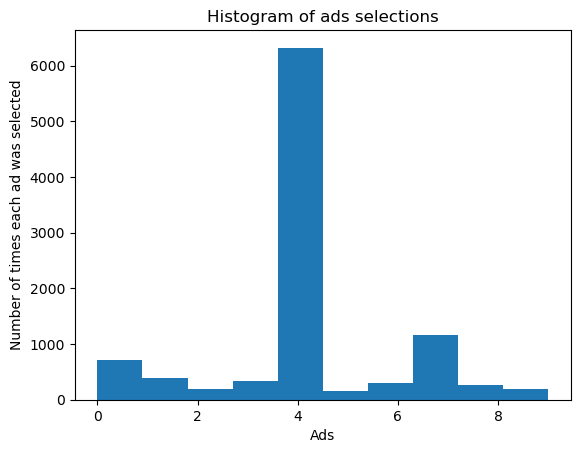

## 📎 Reinforcement Learning 

- Upper Confidence Bound
- Thompson Sampling
---

## 📉 Visualization

Visualization plot of different reinforcement learning method.

|  |  |
|:--------------------------------:|:--------------------------------:|
| **Upper Confidence Bound (Histogram)**          | **Thompson Sampling**          |

---

## 🛠️ Requirements

- Numpy
- Pandas 
- Matplotlib
- Jupyter Notebook
